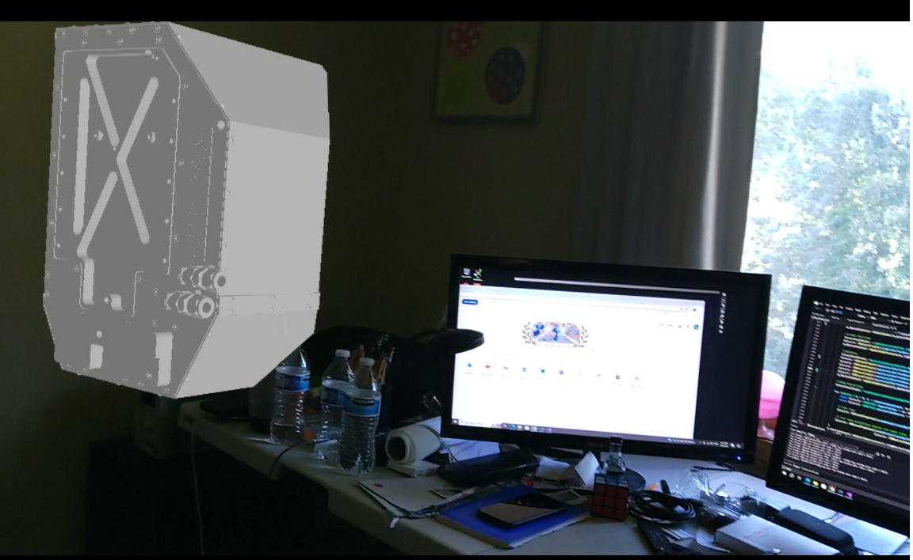
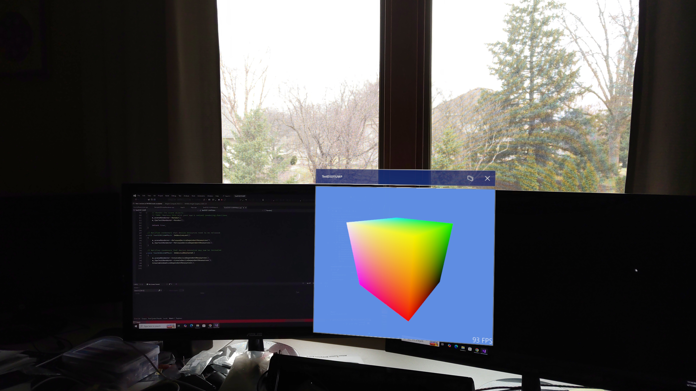

# HoloLens
Collection of toy projects showing holograms or UWP applications in Microsoft HoloLens 2.  This was a cool technology and device, unfortunately Microsoft discontinued it.

- View of the STL CAD object hologram as seen through a HoloLens 2 device.

   

- UWP application as seen through the device.

   
